This report documents a 10 day SSH honeypot deployed on an AWS EC2 cloud service using Cowrie Honeypot https://www.cowrie.org/ to capture and analyze real world attack against an exposed SSH port open to the internet (0.0.0.0/0)
## SETUP
Ubuntu 26.04 LTS was used for the OS of the AWS EC2 instance with an initial security group of a host IP access only on port 22. Cowrie was configured to listen to SSH traffic on port 2223 under a non-privileged user account since Linux restricts ports below 1024 to root processes and running an internet-facing service, especially a honeypot, as root, is a poor security practice. But since an attacker usually attacks SSH on its default port of 22, an iptables NAT rule was added to redirect all incoming traffic on port 22 to port 2223.

prior to redirecting port 22, an access was needed to use the SSH without being redirected to Cowrie, in this case, first through editing the sshd_config of the server (/etc/ssh/sshd_config) to allow SSH on port 2222 instead.Then, through AWS EC2 security group, an inbound rule was added allowing SSH access on port 2222 restricted to my IP address only

*******insert image of security group here later scrub the ip address.

After securing access, Cowrie was installed by cloning from its official GitHub repository (https://github.com/cowrie/cowrie) under a dedicated non-privileged user named Cowrie, in ~/cowrie folder. Python dependencies were installed in a virtual environment as it is best practice to isolate it from system Python installation

Cowrie's default config file was copied from src/cowrie/data/etc/cowrie.cfg.dist to etc/cowrie.cfg inside the Cowrie directory and two changes were made, first the default hostname was changed since many automated SSH attacks blacklists known honeypot hostnames, including Cowrie's default usernames.
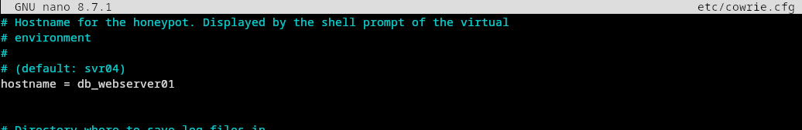

Secondly, the SSH listen_endpoints was set to port 2223 on all interfaces (0.0.0.0)
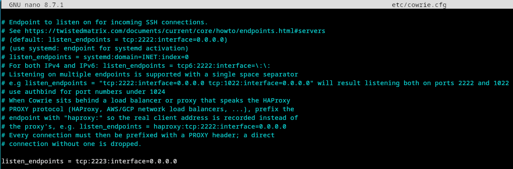

A systemd service was then created to automatically start Cowrie on system boot, ensuring the honeypot remain active after a reboot, in case the AWS EC2 instance reboots.

Finally, an iptables NAT rule was added to redirect all incoming port 22 traffic to Cowrie's internal port 2223:

sudo iptables -t nat -A PREROUTING -p tcp --dport 22 -j REDIRECT --to-port 2223

This ensures that attackers connecting to the standard SSH port of 22 are redirected to the correct honeypot listening endpoint of 2223.

## LOGS

Data was collected over a period of 10 days from August 3 to August 12, 2026. Cowrie logged all activity to a structured JSON file with each event logged as a JSON object. The final dataset of all 10 days includes 13954 events, and Analysis was performed using Splunk Enterprise.


## Analysis

Using Splunk, It was shown that over ten days there were 13954 events recorded, with a single-day peak of 5,232 events on August 4. The day with the least events was August 9 with only 195 events recorded. Based on the graph below, the event frequencies are unevenly distributed and attack volume varied significantly day to day.

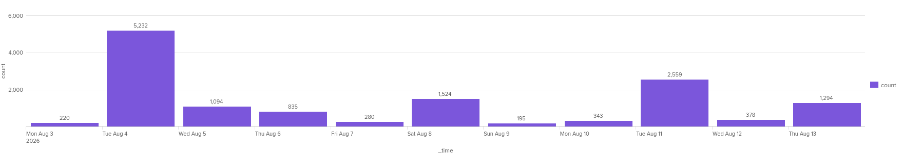

Overall there were 2762 session connects.

However, the unique IP logged tells that August 4th had a low unique IP rate, with the highest in August 13 with 101 unique IPs logged, whereas August 4 only had 27 unique IPs logged. this suggests that the event spike in August 4 was driven by aggresive, high frequency IPs than a big wave of attackers. Overall, throughout ten days there were 551 unique IPs.

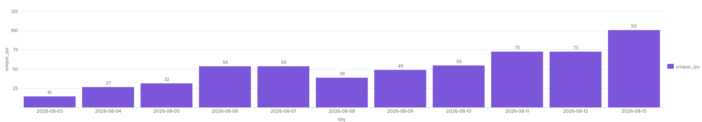

## ON Geography
The geographical location of each attacker's IP is not distributed equally, but it is skewed, as shown on the graph below

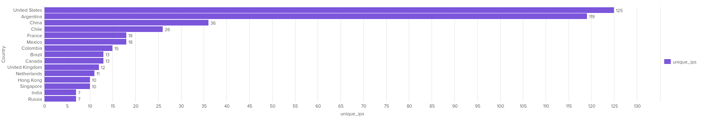

The attacks come mostly from United States and Argentina, making up almost half the total unique IP logged, while china and chile trail behind with a significantly smaller attacks, followed by other countries with attacks below 20 unique IP. The high volume of attacks from the United States could be because of the high amount of Cloud Infrastructure hosted there. Chile and Argentina high count of unique IP suggests that Latin America is being used as proxies for attackers, it could be because of the amount of vulnerable servers and devices present in Latin America, since there is limited cloud infrastructure presence in said country.

Geographic location of these IPs does not necessarily indicate the attacker's location, since IPs could belong to compromised devices or cloud infrastructure hijacked by attackers elsewhere
## On Sessions
Beyond geographic distribution, The data records of the most commonly usernames are as the graph below

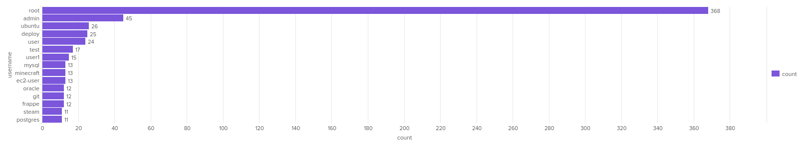

unsurprisingly the most commonly inputted username is root, hoping for access to a root user, with admin and ubuntu being second and third.
The usernames root, admin, ubuntu, user, test, user1, are most likely targeting vulnerable servers with generic accounts that should not exist or have weak passwords on that is poorly configured on a managed server.

The usernames postgres, mysql, oracle, suggests that attackers also target for exposed database servers that use those services (PostgreSQL, MySQL, Oracle Database) who left their account name as default or common server names. 

The usernames ec2-user, and frappe targets cloud based servers that still have their default usernames. ec2-user is the default name for ec2-servers running on Amazon Linux AMI. while Frappe is a cloud web framework that is usually used for the backend of a widely used open source ERP (Enterprise Resource Planning) system ERPNext. This could suggest that attackers target exposed servers of businesses, potentially containing financial records and other sensitive data of businesses.

The username git is an attack targeted towards developers, who might create a dedicated git user account when self-hosting on gitlab or gitea.

The username minecraft and steam is an attack targeted towards game hosters for multiplayer functionality, who might name their servers user account name as minecraft or steam.

The variety of usernames attempted suggests that the attacks used wordlists of commonly used account names instead of targeted attacks and most are of the default account names for each services. The attack also suggests that the attacks target a wide range of services such as cloud hosting, game hosting, self-hosted database, etc, instead of just confined to one service only.

## Passwords
The password attempted for session connects are seen in the graph below

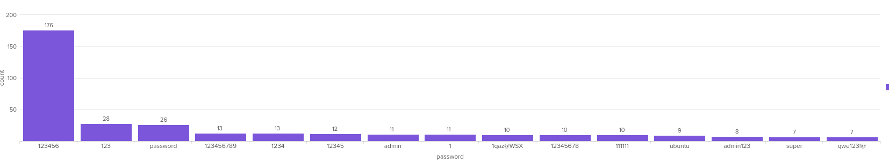

most of these passwords are commonly used passwords such as 123456, 123, 1234, as well as keyboard pattern such as 1QAZ@WSX and qwe123!@. but there are also common default passwords of servers such as admin or ubuntu or admin123.

Most likely the attackers use a comprehensive wordlist for these passwords, either their own or downloaded common password wordlists such as RockYou, the 2009 data breach of 32 Million plaintext passwords.

---
## Banners
Analysis of SSH client version banners shows that SSH-2.0-Go makes up the overwhelming majority of attacker clients

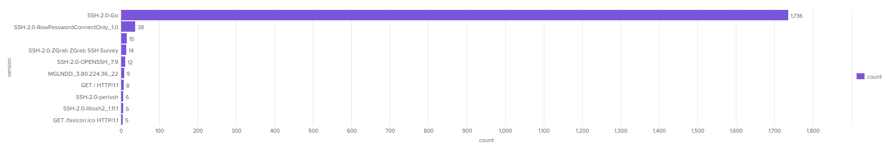

This is consistent with many SSH scanning tools and botnets being built using Go's golang.org/x/crypto/ssh library, whose default client banner is SSH-2.0-Go. The majority of attackers did not customize their client names at all. The same goes for SSH-2.0-OpenSSH_7.9 and SSH-2.0-libssh2_1.11.1, which is the default banners for OpenSSH version 7.9, and libssh2), while SSH-2.0-RawPasswordConnectOnly_1.0 is a custom client banner, which could suggest that it is a purpose-built which functionality is only to authentiate passwords.  Another client version is 'SSH-2.0-ZGrab ZGrab SSH Survey', utilizing Zgrab utility tool which is a network scanner for Internet Wide surveys. The client version MGLNDD_3.80.224.36_22 is a client name that has the victim's IP and port embedded in its version (MGLNDD_IP_Port). MGLNDD is a payload associated with the Magellan Project using RIPE Atlas, made by RIPE Network Coordination Centre (RIPE NCC), a non-profit Regional Internet Registry.According to this research https://www.mdpi.com/1424-8220/26/1/11 It is a legitimate internet measurement initiative to measure internet connectivity and reachability and not a malicious one. There were 8 connections with the client of GET / HTTP/1.1 and 5 with GET /favicon.ico HTTP/1.1 . This could be caused by indiscriminate port scanners sending HTTP payloads at every open port regardless of the service. 15 connections were sent with an empty client banner suggesting the attacker intentionally scrubbed data to avoid fingerprinting.

## In-depth Analyses

Some attacks are interesting enough to have an in-depth analysis of the attacks. 

### 61.240.141.125
This IP attacked on the 6th of August. It had 3 sessions, first two sessions were only Connects and Close as seen below.

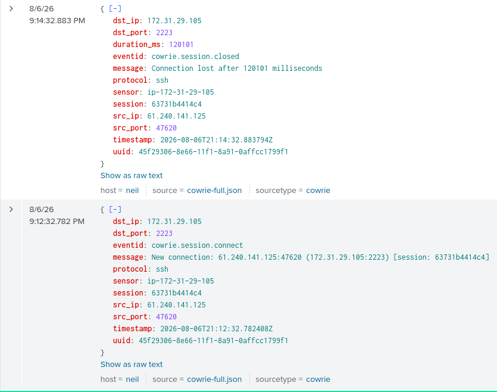
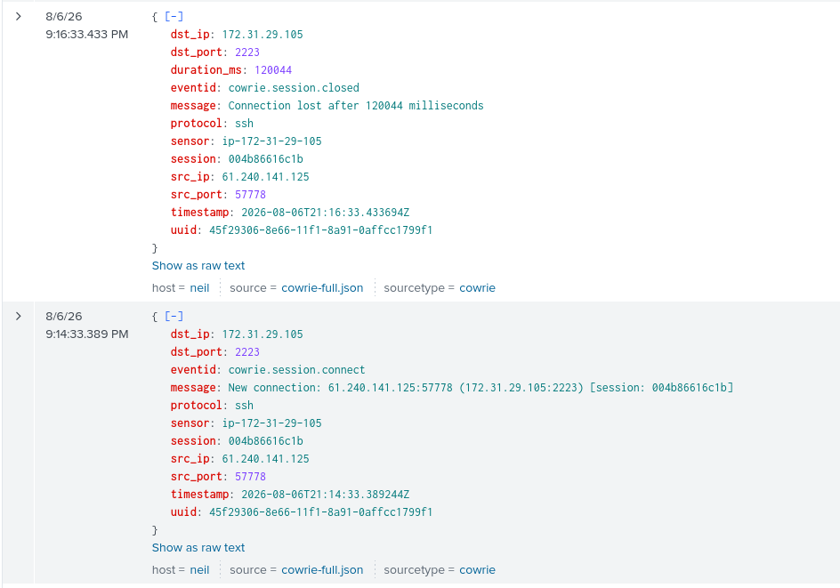

The attacker connected for two minutes without any SSH handshake or login attempts at all.(21:12-21:14, 21:14-21:16) This is a common pre-attack behavior to do a scouting of checking the victim's latency/stability, or if the target responds at all at certain ports.

The attacker connected in the next session immediately after (21:16) and actually performed an SSH handshake, as seen in this SSH version banner and key exchange.

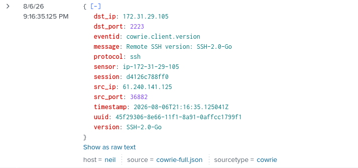
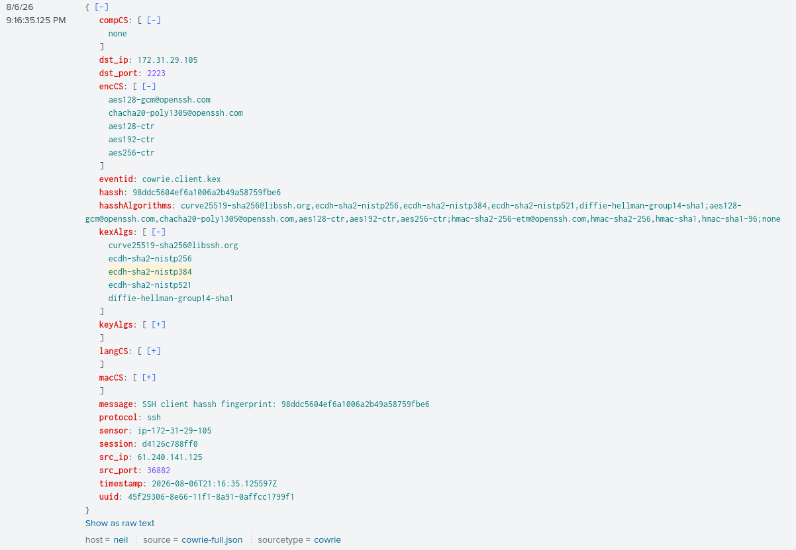

After that, they successfully login with the username root and password centos, a common password for the CentOS Linux distribution, most likely from password spraying instead of a targeted attack.

The attacker waited for 5 minutes (21:16-21:21) before uploading a file through SFTP named 'sshd' with the SHA256 hash of 041de4f1f393265f6070a00b700e7c20e9b915f6537f7b345f73b8d46aad2130
and immediately exited the session after the upload.

### IP Analysis
A search using Shodan Search Engine of the IP (61.240.141.125) found that it belonged to Qinhuangdao Museum (秦皇岛博物馆) in Hebei, China. It had an active HTTP and HTTPS port, but is inaccessible at time of writing via both direct IP and hostname (qhdbwg.com), likely due to the Great Firewall restricting access to domestic servers or that the server has been taken offline. 

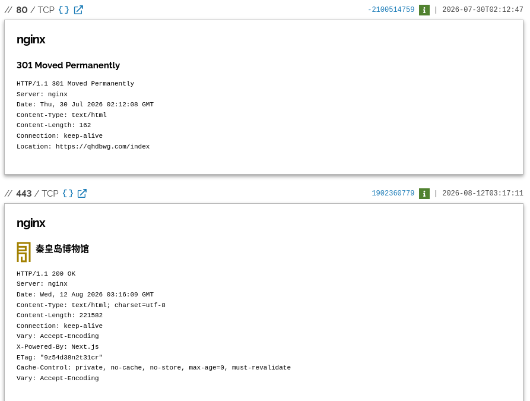

It is unclear how this server was initially compromised and used as a proxy by the attacker, at the time of writing the only ports visible on shodan are HTTP and HTTPS. 

### File analysis

A virustotal search of the hash shows that the file uploaded was an ELF file (Executable and Linkable File Format), for a cryptocurrency miner.

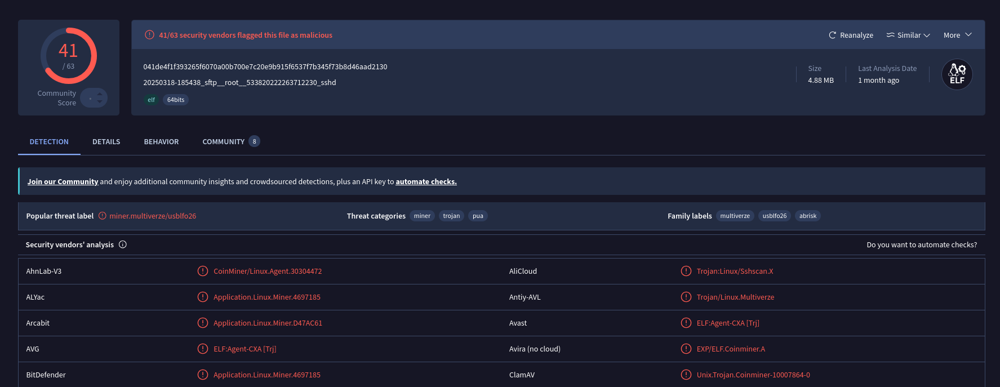

To verify this, using a software reverse-engineering tool such as Ghidra is recommended, but a basic verification can be achieved by using the strings command to extract readable text from binary. And the first few lines show that it is indeed an ELF

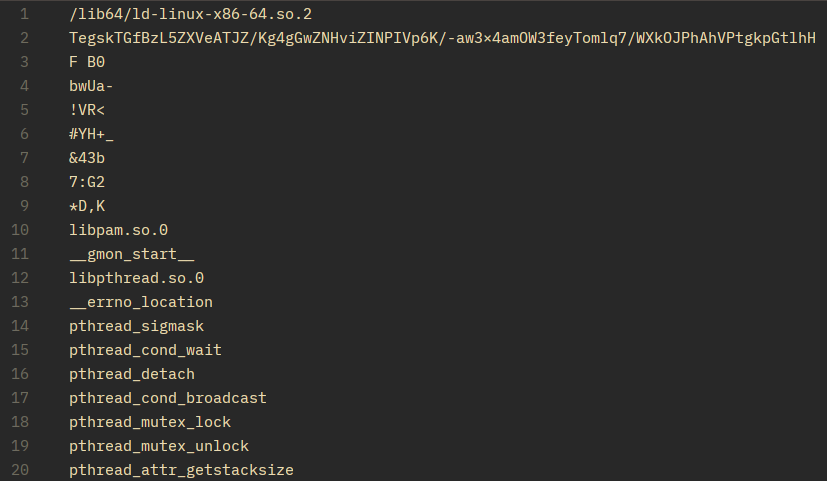

/lib64/ld-linux-x86-64.so.2 is the standard dynamic linker/loader for 64-bit Linux systems. This confirms that the malware only works on Linux filesystems, and does not work on MacOS or Windows.

To verify that this malware is a miner can be achieved by searching common tools for cryptocurrency mining, as seen below

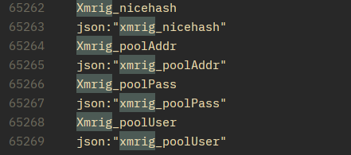
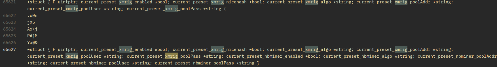

This shows that it is indeed a cryptocurrency miner, using XMRig, a popular open-source mining application.

#### Conclusion
IN summary, this IP belongs to a Chinese Museum server that was compromised and used as a proxy to distribute XMRig-based cryptocurrency mining malware targeting Linux systems.


### 193.178.59.219
This IP attacked on the 10th of August, it had 4 sessions, but they ran 2 sessions in parallel, as seen below.

-- image of the cowrie connect

the first 2 sessions ran within 50 miliseconds of each other, and performed an SSH handshake. The client banner identified it as an OpenSSH client running on a debian 11 'Bullseye' system. (SSH-2.0-OpenSSH_8.4p1 Debian-5+deb11u3).

the two session had a different login parameters, the first session (77f534d25e6b), used pi as a login and raspberry as the password

--image of login

and the second session (9f9ffef1c4ef), used pi as a login and raspberryraspberry993311

--image of second login

Other than the login credentials, the two sessions ran identically.

The attacker's SSH client passed environment variables to the session and the data is shown in cowrie.client.var below

--image of the var

what is interesting is that the language requested is de_CH, German language specifically used in Switzerland. compared to de_DE which is standard german.

Cowrie also ascertained that the architecture of the attacker is a 64bit Linux system

--image of the 64bit

Rather than opening an interactive SSH shell, the attacker used SCP to upload the file directly as seen below.
--image of the upload

The attacker likely ran a command similar to:
scp V62vtXQH pi@172.31.29.105:/tmp/

The First two sessions only lasted for about 2 seconds (13:28:30-13:28:32)

The next parallel sessions had the same login credentials and they did two commands per sessions, seen below

-- image of commands

The attacker gave execution permissions to the file they sent to /tmp using the chmod command, and tried to run it with bash and ./V62vtXQH. Because Cowrie is designed as a fake server, the attacker likely closed the connection soon after it didn't run the commands successfully.

### IP analysis
Shodan had no records for this IP,

--- image of shodan

But using ipinfo.io, it shows that the location of the IP server is in Hamburg, Germany using Wilhelm Telecommunication service as a provider. And as of writing, there has been 13 abuse reports to the IP on abuseipdb.com, and all reports were SSH-related. uggesting this IP is specifically used for SSH-based attacks rather than broader scanning

--- image of ipdb
### File Analysis

According To Virustotal, The hash of the malicious file (6d1fe6ab3cd04ca5d1ab790339ee2b6577553bc042af3b7587ece0c195267c9b) is classified as a shell script trojan targeting vulnerable SSH servers. According to Palo Alto Networks Threat Research, this hash is associated with Eleethub, a cyptocurrency mining botnet operation where the initial file is used to establish a shell connection using an IRC-based Command and Control (C2) architecture to establish a persistent backdoor to the system, which the C2 could use to execute commands via IRC

Internet Relay Chat or IRC is a real time text-based communication protocol, created in 1988 by Jarkko Oikarinen. while IRC in itself is not a malicious protocol or can execute commands, a script on a victim's server can reads messages on a loop and extracts a certain message to execute.


This can be verified by seeing the plaintext of the malware using strings. he first line confirms this is a bash script.

--photofirstline

#!/bin/bash tells OS that to use bash to execute this script using bash as interpreter.

The next few lines shows that the script actively attempts to eliminate competing mining operations

--photokillall

here, they are trying to kill processes related to mining operations such as minerd, ktx- and others. Interestingly the attacker also ran 
echo "127.0.0.1 bins.deutschland-zahlung.eu" >> /etc/hosts, redirecting any traffic destined for `bins.deutschland-zahlung.eu` to the local machine (127.0.0.1), effectively blocking it. This is likely a cryptocurrency mining competitor's hostname the attacker is blocking.

On line 38 it is confirmed that they are trying to add an SSH backdoor:

--photo of it

this command appends the Attacker's public SSH keys to /root/.ssh/authorized_keys, granting the attacker permanent root SSH access using their own private key.

These lines show that the attacker is trying to connect to undernet IRC servers on port 6667, and on line 88 they are trying to connect to a specific server on undernet named #Biret

-- two photos undernet

And in line 92-108, the script is configured to intercept any PRIVMSG (Private Message command) from the IRC is received, it checks if the private message is from the legitimate attacker by comparing RSA signature, then if it is, executes the command on the infected machine.

-- photo 92-108
### Conclusion
This attack is a more sophisticated attack compared to the direct file upload miner delivery on the first sessions. Rather than deploying a miner, the Eleethub botnet establishes control by adding an SSH backdoor and recruiting the machine to an IRC Network, which any subsequent payload such as cryptocurrency miners would be delivered via commands executions in IRC with PRIVMSG. 

---

### 71.30.205.149
This IP connected on the 8th of August at 5:46 PM, their attack lasted for about 13 seconds. 

Their client banner shows that they were using Libssh2 SSH client, (SSH-2.0-libssh2_1.11.1). The IP tried to login as root/root, but failed, and a second login of root/admin succeeded

-- image of the thing

The attacker did not upload a file, but they wrote multiple commands that are worth looking at. the first thing they did was /ip cloud print

-- image of it

/ip cloud print is not a command for Linux, but it is a command for RouterOS systems, used by MikroTik hardwares. This command tries to open to the IP menu on RouterOS and prints the cloud configuration submenu, that manages Dynamic DNS. Image below is an example of the data shown using it

-- image

Then they did ifconfig, a command that only works on Linux/Unix systems, not RouterOS, so likely this attacker is not specifically targeting MikroTik services but spraying. ifconfig shows Ip addresses, Mac addresses, interface names, among other things.

The next command they did was uname -a, this command shows system and kernel systems, an example would be something like:
```
Linux server-01 6.8.0-40-generic #40-Ubuntu SMP PREEMPT_DYNAMIC Mon, Aug 12 11:20:15 UTC 2024 x86_64 x86_64 x86_64 GNU/Linux
```

In this example it shows shows Kernel name (Linux), Hostname (server-01), Kernel Release (6.8.0-40-generic) Kernel Version (#40-Ubuntu SMP PREEMP_DYNAMIC), Kernel Build Timestamp (Mon, Aug 12 11:20:15 UTC 2024), Machine Architecture(x86_64), Processor Type (x86_64), Hardware Platform(x86_64), and operating system(GNU/Linux).

Afterwards they did cat /proc/cpuinfo to check CPU info, likely to gather system information, possibly to access hardware viability for cryptocurrency mining, such as model name and core count, and flags such as aes, avx2, avx512 (AES Encryption), to mine cryptocurrency efficiently.

This is proven by their next two commands, ps | grep '\[Mm]iner' and ps -ef | grep '\[Mm]iner'.

--images

This command shows the attacker if there are any processes running with the name Miner/miner. this is common in cryptocurrency mining attacks because a system that already has a miner will not perform efficiently, so usually the attacker if they found one, deletes the competitor's mining processes first.

The next command is a malicious data gathering command, seen below

--image

this command lists files, including hidden files, and their detailed information. 

`~/.local/share/TelegramDesktop/tdata /home/*/.local/share/TelegramDesktop/tdata`

are folders that holds telegram desktop login session and account information, such as Authentication Tokens and session data. If an attacker holds such information, they could access the victim's Telegram session.

`/dev/ttyGSM* /dev/ttyUSB-mod* /var/spool/sms/* /var/log/smsd.log /etc/smsd.conf* /usr/bin/qmuxd /var/qmux_connect_socket /etc/config/simman /dev/modem* /var/config/sms/*`

These are all about SMS, such as USB Modems, SMStools/smsd daemon, Qualcomm services, and Sim managers. A vulnerable SMS service such as /dev/tty* can be used to read incoming 2 Factor Authentication SMS messages.

They could also hijack any connected SIM cards for a proxy for phishing.

Next they ran locate D877F783D5D3EF8Cs,

--locate

according to securelist.com, D877F783D5D3EF8Cs is a file that contains user ID and encryption key for interaction between desktop client and telegram servers.

The last thing they did before exiting is to do an echo command of echo Hi | cat -n

-- image echo

This is peculiar because it does not do anything, only to print:
     1	hi

This is usually a connectivity test to check if the SSH is executing commands, but it usually happens at the start, not the end, so it is unclear what the attacker ran it for.

### IP analysis
A shodan search procured no results, but using ipinfo.io shows that the IP originated from Albuquerque, New Mexico. 

-- photo

A search in abuseipdb.com also shows 223 user reports as of writing, higher than the previous of 13, with most tags being SSH.

### Conclusion
Unlike other sessions we analyzed, this attacker's also focused on credential theft and account hijacking with searching for Telegram session data and SMS vulnerabilities to possibly bypass 2FA. The attacker did also behave for cryptocurrency mining operations as well. The attacker also does broad targetting of systems, not just linux but MikroTik RouterOS commands.

# Conclusion
Vulnerable SSH attacks are still commonplace today, attackers are not merely individuals but botnets too, ranging from automated port scanning to malware delivery and credential theft. The attackers use multiple ways to inject malware from SFTP file uploads to shell injections via IRC C2s.

The majority of observed attacks were motivated by computing power for their cryptocurrency mining operation, potentially making the victim's hardware run slower or even racking up bills for the victim in cases of attacks to a cloud server, by increasing compute cost. In cases of credential/account theft, attackers may steal Telegram or other social media/telecommunication session tokens or access SMS services for two-factor authentication bypass.

The attacks can largely be avoided if the user takes some precaution and a fundamental understanding of Security Hygiene.

First, Do not expose your SSH port to 0.0.0.0/0 if you can avoid it. Restricting SSH access to known IPs will make it impossible for outside IPs to attack your devices entirely. Most services that use SSH do not require for the SSH port to be open to the internet. But, if restricting your SSH port is not possible, there are still some safety precautions you can take.

Disable password authentication for SSH logins. Password authentication can be disabled entirely in sshd_config, and opting for keypairs is significantl more secure. Unlike passwords which can be leaked, guessed, or brute-forced, keypairs are a modern SSH keypair such as Ed25519 uses a 256-bit private key, with more combinations than the atoms in the universe, making brute-forcing and guessing practically impossible. It is still possible however for your key to be leaked if you store it irresponsibly, just like any other password or file. But, if you still need to use password authentication, there are still additional precautions worth taking.

Do not use common credentials for your devices. Most of the attackers look for common credentials by password spraying/brute forcing their way in, using wordlists such as the Rockyou wordlist. Using a long, randomly generated passphrase or string is recommended

Change your SSH port to a nonstandard port. moving your SSH port to a nonstandard port can reduce automated scanners significantly, since most SSH attacks assume the victim's SSH port is still in port 22. This however should not be relied for primary defense because it does not eliminate every attacker traffic to your SSH ports, as more thorough attackers perform full port scans before attempting authentication.

There are also some general rules beyond SSH-specific practices to keep your devices safe.

Keep your systems up-to-date. New vulnerabilities in operating systems and kernels are discovered constantly, and even on LTS Operating Systems. Be sure to regularly check for updates to your Operating Systems, as it could have patches for critical vulnerabilities.

Monitor for any new, unrecognized processes and key access. From the data gathered over the 10 days, all observed malicious file uploads in this collection targeted cryptojacking. Cryptojacking leaves detectable traces on your computer, such as using high CPU/GPU power. If your device is running slower than expected, inspect running processes for unrecognized entries. unexpected new SSH keys in `~/.ssh/authorized_keys` are also strong indicators of compromise.

## Closing
The data collected over this 10-day honeypot demonstrates that no internet-exposed SSH is safe from attacks. However, an open SSH port with security hygiene is significantly better than an open SSH port with none. Practices such as disabling password authentication and keeping systems updated are sufficient to stop the majority of attacks observed over the 10-day collection period.


